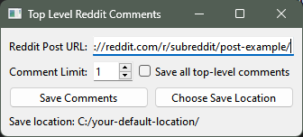

# Save Top Level Reddit Comments

This Reddit Top Level Comments Save utility is a Python application that allows users to download and save comments from Reddit posts into CSV files. Built using Python with PySide6 and PRAW (Python Reddit API Wrapper), this tool is designed for ease of use, providing a simple graphical interface to interact with Reddit's API. The reason I created this is I'm someone who has a lot of posts saved, and often times finds that when the post is asking a question, all I want to know are the top parent responses.



## Tables of Contents

- [Languages Used](#languages-used)
- [Technologies Used](#technologies-used)
- [Features](#features)
- [Installation](#installation)
- [Usage](#usage)
- [Contributing](#contributing)
- [License](#license)

## Languages Used

- Python

## Technologies Used

- PySide6
- PRAW (Python Reddit API Wrapper)

## Features

- **Download Comments**: Fetch comments from any Reddit post using its URL.
- **Customizable Comment Limit**: Choose how many top comments to download.
- **Sorting and Filtering**: Comments are sorted by points and can be limited by a user-defined number.
- **Save to CSV**: Comments are saved in a CSV file, which includes points, number of replies, and the comment text.
- **User-friendly Interface**: Simple and intuitive graphical user interface.
- **Default Save Directory**: Set a default directory for saving the comment files.
- **Changeable Save Location**: Option to change the save location for each session.

## Installation

1. Clone the repository or download the source code.
2. Install the required Python packages:

   ```shell
   pip install PySide6 praw
   ```

3. Input your credentials in the `main.py` file.

## Usage

1. Run the application:

   ```shell
   python */script.py
   ```

2. Enter the URL of the Reddit post from which you want to download comments.
3. Set the limit for the number of top comments to save.
4. Optional: Select to save all top level comments.
5. Choose the save location (or use the default one).
6. Click "Save Comments" to download and save the comments to a CSV file.

## Contributing

Contributions, issues, and feature requests are welcome.

## License

[MIT LICENSE](LICENSE)
